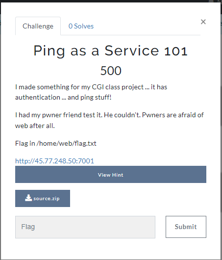
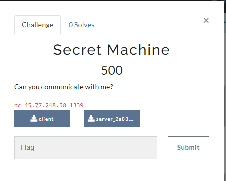

1. ### re

a. 


b. 


2. ### web

a. 


Challenge: `http://45.77.248.50:22108/`


b. 


Challenge: `http://45.77.248.50:20109`

`Note`:

- Report admin at: `http://45.77.248.50:20109/report`
- Admin bot local docker port: `http://127.0.0.1:13337`

hint : **Recaptcha**

hint : 

`router.get('/', (req, res) => { **let** name = req.query.name; 	**if** (!name) { 	name = "" }  **if** (name.match(/<(script|svg|iframe)/i)) { 	name = "Don't hack" } 	**return** res.render('index.html', {name: name}); });`


c. 


Đây là một API: [http://45.77.248.50:3333](http://45.77.248.50:3333/)

Bước 1: Bạn thực hiện lấy url để upload lên cloud của chúng tôi và thực hiện upload

http://45.77.248.50:3333/upload-url

=> Chúng tôi sẽ đưa cho bạn một **key**, hãy upload file lên nhé

Bước 2: Bạn truy cập

http://45.77.248.50:3333/download-url/{{key}}

=> Bạn sẽ tải được tập tin này về

Tất nhiên, đây là API, bạn không thể có frontend, frontend nằm ở hệ thống khác của chúng tôi, hãy thử **forensic**?


hint 1 : 

gist.github.com

hint2 :

https://gist.github.com/vinhjaxt/1d901a2f7cb49a40962f8e93052cf4f8

hint 3 :

body json {recaptcha: xxx, fileName: xxx, metadata: {a: 1}}

bypass recaptcha pleaseeee!

hint 4 : 

Final hint: 127.0.0.1


d. 


Đây là một API: [http://45.77.248.50:3333](http://45.77.248.50:3333/)

Bước 1: Bạn thực hiện lấy url để upload lên cloud của chúng tôi và thực hiện upload

http://45.77.248.50:3333/upload-url

=> Chúng tôi sẽ đưa cho bạn một **key**, hãy upload file lên nhé

Bước 2: Bạn truy cập

http://45.77.248.50:3333/download-url/{{key}}

=> Bạn sẽ tải được tập tin này về

Tuy nhiên, chúng tôi còn có thêm một số endpoint cũng khá là interesting ^^

**Crawler** http://45.77.248.50:3333/url?url=http://google.com

=> Chúng tôi sẽ follow theo url này, gửi về cho bạn kết quả Và bạn biết flag nằm ở đâu không? Chính xác, đó là /flag

**Chaizo!!!**

Tất nhiên, đây là API, bạn không thể có frontend, frontend nằm ở hệ thống khác của chúng tôi, hãy thử **forensic**?


**hint : Prototype**

**ssrf**

**Final hint: header**


3. ### crypto

a. 


b. 


c. 


hint : 

**Coppersmith's attack**

**Short-pad?**

4. ### Forensic


a. joke 


b. 


c. 


https://drive.google.com/file/d/1QKUI32s9PuaDAeM6ksBGJKbyQSqOmHIt/view?usp=sharing


Compareeeeeeeeeeeeeeeeee!

Wavelength


d. 


I don't have much information about it. But I guess the password can be generated using familiar information like username, date of birth, favorite animal. Or even hostmail.Pass zip: ctf@last!@#cde

https://drive.google.com/file/d/1zEWexSZd1OxqAIKDAsKb7TZsutAur3jW/view?usp=sharing


hint

**Crack Bitlocker!**

**Generate your password list, not using keyword `common password google` >.<**

5. ### PWN

a. 


```c++
nc 45.77.45.157 1338
```

or

```c++
nc 58.84.1.125 1338
```

b.


std::string is slow, so I made my own.Flag in /home/chall/flag.txt`nc 45.77.248.50 7002`


hint :

Do you know std::vector?

As AngelBoy once said...


c. 



I made something for my CGI class project ... it has authentication ... and ping stuff!

I had my pwner friend test it. He couldn't. Pwners are afraid of web after all.

Flag in /home/web/flag.txt

[http://45.77.248.50:7001](http://45.77.248.50:7001/)


hint : lstat ... This function treat files and directories similarly...

d. 


Kill monster is hero's goal

Follow hero to kill monster is trooper's goal

Kill hero and trooper is monster's goal

Capture the Flag is your goal!

`nc 45.77.248.50 1337`

hint : 

Can you find the overflow?

Can u find something at Hall of Fame

e.




Can you communicate with me?`nc 45.77.248.50 1339`


